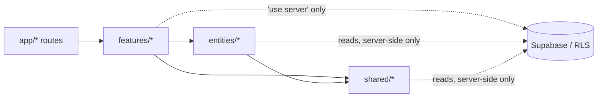
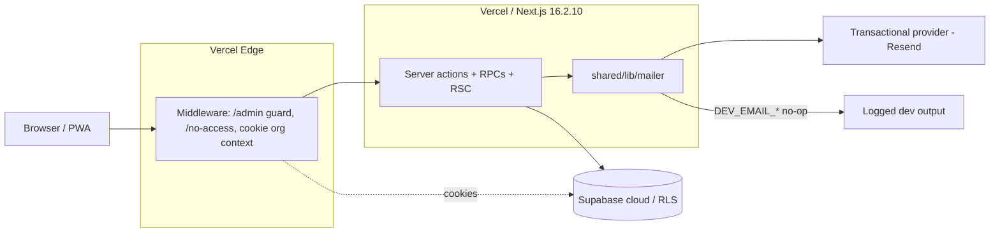
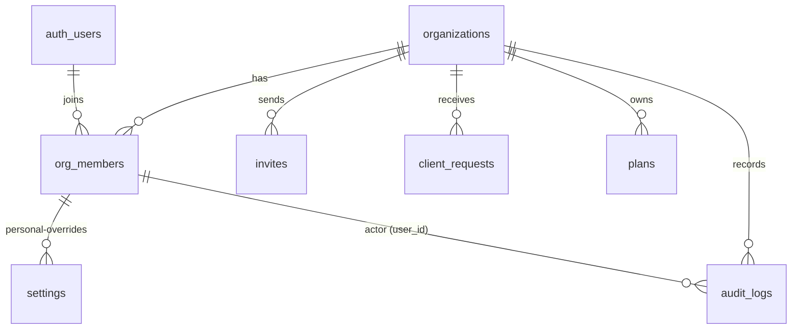

# Architecture Spine — Ledgerly Org Administration

## Design Paradigm

Feature-Sliced Design with a server-action mutation boundary and RLS-authoritative data. The UI is sliced by domain feature; each slice owns its server actions (the only legal write path), and RLS is the authoritative data boundary the app can read but never bypass. The active org is carried in a single httpOnly cookie written only by server code.

```text
app/* (routes, middleware)
  → features/{expenses,reports,categories,settings,org,invites,admin,auth}
      → entities/{org,invite,expense,...} (repositories)
          → shared/{ui,lib,config}   (design system, supabase clients, helpers)
```

## Invariants & Rules



### AD-1 — Server actions are the only mutation boundary

- **Binds:** all mutation FRs (FR-13, FR-22, FR-23, FR-25, FR-26, FR-30, FR-31, FR-34) and any future write path.
- **Prevents:** client-side writes bypassing RLS/validation; drift between optimistic UI and committed state.
- **Rule:** Every database write (roster, invites, plans, org settings, requests, audit) must go through a `'use server'` action in `features/*/actions.ts`; client components never call the Supabase client to write. Repositories (`entities/*/repository.ts`) and `shared/lib` are read-only builders — `shared/lib/audit-logger.ts` and repository code may only write when invoked from inside a server action. Actions revalidate affected routes with `revalidatePath`.

### AD-2 — RLS is authoritative; app checks are defense-in-depth

- **Binds:** all data-access FRs; `is_org_member` / `can_write_in_org` / new `can_admin_org` usage.
- **Prevents:** app-only gating that fails open when a route forgets its check.
- **Rule:** Authorization must be enforced in RLS (SECURITY DEFINER helper functions); role checks in app/middleware exist only as UX/defense-in-depth and never as the sole gate.

### AD-3 — Active org is a single httpOnly cookie, written only by server code

- **Binds:** FR-2, FR-3, FR-4 (OrgSwitcher), FR-8 (no-access redirect).
- **Prevents:** client cookie shadowing (root cause of the earlier `/expenses` "no active org" failure), stale per-org caches, cross-tab org leakage.
- **Rule:** `ledgerly_active_org` is written by exactly one path — server code via `cookies()` (server actions and the middleware guard); the client never writes it. Switching triggers a full-page reload. `ensureActiveOrg` (read surface: `getActiveOrgIdAction` server action) repins the earliest-`created_at` membership whenever the cookie is absent, invalid, or names an org the user left — and must run before the `/no-access` branch can fire for a user who still has memberships. Logout (FR-3) clears the cookie before `signOut`.

### AD-4 — Org-admin boundary is `can_admin_org`; `/admin` is super_admin-only

- **Binds:** FR-4, FR-5, FR-8, FR-25, FR-26, FR-31, FR-32, FR-34.
- **Prevents:** any-member roster tampering / self-escalation (the `010_unify_org_member_write` uniform-write relaxation, `010:12`); org_admin reaching `/admin`; org admins mutating platform staff rows.
- **Rule:** Migration 013 adds SECURITY DEFINER `can_admin_org(org_id)` (true for `org_admin` members and super admins of that org) and closes the uniform-write relaxation on admin surfaces (roster, invites, requests, plans, audit reads). Roster/invite/request/plan mutations require `can_admin_org(org_id)` or `is_super_admin()`. `org_admin` is a plain `org_members.role` value; platform `super_admin` rows are out of org-admin scope. Only `is_super_admin()` may create/update rows whose `role = 'super_admin'` — admin-surface tables must not let a generic membership policy double as a `WITH CHECK` for role writes (the `010` relaxation's failure mode). Middleware redirects `/admin` unless `role = 'super_admin'`; a member whose pinned org was removed but who has other memberships goes back to `/dashboard` for `ensureActiveOrg` to repin — `/no-access` is reserved for users with no membership at all.

### AD-5 — Approval and join are single atomic DB operations

- **Binds:** FR-13, FR-22, FR-23, FR-30, FR-34.
- **Prevents:** partial joins; a dead approval path that "succeeds" while creating nothing (the current `approve_client_request` returns NULL for new users, `012:120-124`); the `accept_invite` write to the nonexistent `expense_settings` table (`012:256`).
- **Rule:** Migration 013 corrects `accept_invite` (SECURITY DEFINER, single transaction, writes `settings`). Platform approval is a service-role server action that creates the user (if new) + org + subscription in one transaction, assigns the first org admin at approval, and supersedes `approve_client_request`. Re-submission after rejection creates a new pending row. The join/approval sequence is `createUser (GoTrue, outside the DB transaction) → DB commit → email only after both succeed`; `accept_invite`'s settings write is an `ON CONFLICT (user_id, org_id) DO UPDATE` per-field merge so re-joining members never violate the `settings` uniqueness constraint.

### AD-6 — Audit log is one canonical implementation, insert-only via a logging RPC

- **Binds:** FR-27, FR-29, FR-33.
- **Prevents:** two divergent audit schemas; forgeable/unattributable rows; logs admins cannot read.
- **Rule:** Migration 013 establishes a single SECURITY DEFINER logging RPC (insert-only). The RPC re-derives the actor server-side (service-role clients carry no `auth.uid()`) and records `ip_address` + `user_agent` from the caller; it is the ONLY write path — the service-role key is revoked from `audit_logs`, and ALL existing write sites (`entities/org/repository.ts` direct insert and the divergent `shared/lib/audit-logger.ts`) are migrated onto it. A pinned action vocabulary keeps rows canonical (schema = migration-002 shape: `org_id, user_id, action, entity_type, entity_id, old_value, new_value`). SELECT narrows to `can_admin_org(org_id)` or `is_super_admin()`.

### AD-7 — Email is delivered via a transactional provider behind a mailer module

- **Binds:** FR-7, FR-12, FR-22, FR-34.
- **Prevents:** "email sent" toasts with no email; hardcoded/committed provider secrets.
- **Rule:** All outbound mail goes through one mailer module (`shared/lib/mailer`) backed by a transactional provider (Resend); `RESEND_API_KEY` in server env only; `DEV_EMAIL_*` vars enable a logged no-op so invites never silently "succeed". No provider keys in the repo or client bundle. The transactional provider is the single app-owned email channel for invites and new-user notifications — GoTrue's own admin emails are not relied on for these. The mailer emits a send-id, logged and correlated to the request/invite row for observability.

### AD-8 — Org-wide defaults live on `organizations`; personal overrides stay in `settings`

- **Binds:** FR-18, org-wide settings FRs.
- **Prevents:** divergent org-default storage; retro-rewrites of historical VAT.
- **Rule:** Migration 013 adds `default_currency` + `default_vat_rate` columns to `organizations` as the org-wide source; existing per-(user, org) `settings` rows remain personal overrides. VAT/currency changes apply to NEW expense entries only. One shared effective-value resolver (used by dashboard, settings, and expense entry) computes: org default (base) → personal `settings` row override → explicit per-entry value; all read surfaces must use it.

### AD-9 — Roster emails come from service-role lookup, not a new column

- **Binds:** FR-7, roster display FRs.
- **Prevents:** duplicating `auth.users.email` under RLS (a leak surface); schema churn for a read-only display field.
- **Rule:** Member emails in roster/admin surfaces are resolved through the existing service-role `auth.admin.listUsers` matching pattern — the only member-email resolver; no path may fetch member emails via direct SQL against `auth.users`. `profiles` gains no email column.

## Consistency Conventions

| Concern | Convention |
| --- | --- |
| Naming | FSD slices (`features/*`, `entities/*`); DB tables/columns snake_case; TS camelCase; files kebab-case; repositories as `entities/*/repository.ts`; actions as `features/*/actions.ts` |
| Data & formats | uuids via `gen_random_uuid()`; ISO-8601 datetimes; money as integer minor units; currency amounts rendered `tabular-nums`; zod validation at every action boundary |
| State & cross-cutting | Mutations only in server actions + `revalidatePath`; server actions return `{ data, error }`, never throw to client; toasts via the custom toast (bottom `bottom-20 md:bottom-4`); errors surface in UI, not console-only |
| Config & auth | RLS helpers `SECURITY DEFINER STABLE`; active org via AD-3 cookie; migrations authored in `supabase/migrations/` and applied through the Management API — prefer its `database/migrations` endpoint (records history) when available, fall back to `database/query`; never `db push`; envs: `NEXT_PUBLIC_SUPABASE_URL`, `NEXT_PUBLIC_SUPABASE_ANON_KEY`, `SUPABASE_SERVICE_ROLE_KEY`, `RESEND_API_KEY`, `DEV_EMAIL_*` |
| Operations & observability | Mailer logs send-ids correlated to request/invite rows (AD-7); failures surface in the UI and server logs, never silent; monitor via Vercel + Supabase dashboards (PRD observability NFR) |
| Styling | Dark-first tokens only (`bg-background`, `text-foreground`, emerald `#34d399` primary, indigo `#818cf8` secondary); deprecated Material tokens forbidden; full token set in UX DESIGN.md |

## Stack

| Name | Version |
| --- | --- |
| Next.js (Turbopack) | 16.2.10 |
| React / React DOM | 19.2.4 |
| TypeScript | ^5 |
| Tailwind CSS | v4 (`@tailwindcss/postcss`) |
| @supabase/supabase-js | ^2.49.1 |
| @supabase/ssr | ^0.6.1 |
| zod | ^3.24.1 |
| react-hook-form (+ @hookform/resolvers) | ^7.54.2 / ^3.9.1 |
| @tanstack/react-query | ^5.64.1 |
| recharts | ^2.15.0 |
| lucide-react | ^0.469.0 |
| Radix primitives (avatar / dialog / dropdown-menu / slot) | 1.2.2 / 1.1.19 / 2.1.20 / 1.3.0 |
| class-variance-authority | ^0.7.1 |
| clsx | ^2.1.1 |
| tailwind-merge | ^3.6.0 |
| framer-motion | ^11.18.0 |
| date-fns | ^4.1.0 |
| jspdf (+ jspdf-autotable) | ^2.5.2 / ^3.8.4 |
| sonner | ^2.0.0 (present; unused — custom toast) |
| Resend SDK (AD-7) | new in scope — pin at implementation |
| Vitest | ^4.1.10 |
| ESLint (eslint-config-next) | ^9 / 16.2.10 |
| Platform: Vercel (auto-deploy on push to main) | current |
| Platform: Supabase (project weitlewvoufvgfpkryvg) | cloud |

## Structural Seed

Deployment & environments:



Core entity relationships:



Minimal source tree:

```text
src/
  app/
    (auth)/login/ ... (public routes)
    (org)/
      dashboard/ expenses/ reports/ categories/ settings/
      settings/organization/  settings/members/   # new org admin surfaces
      invite/  no-access/                          # new routes
    admin/                                         # super_admin console
    middleware.ts                                  # guards + cookie tenancy
  features/
    org/       # OrgSwitcher, active-org actions (ensureActiveOrg)
    invites/   # invite lifecycle (org_admin gated)
    admin/     # requests queue, plans editor, audit log (super_admin)
    settings/  # org-wide defaults (AD-8) + personal
    expenses/ categories/ reports/ auth/           # existing
  entities/
    org/  invite/  expense/  ...  # repositories
  shared/
    lib/ supabase/ ui/  config/
    lib/mailer/              # AD-7
    lib/audit-logger.ts      # rewritten onto the AD-6 RPC
supabase/migrations/012_security_hardening.sql  # existing
supabase/migrations/013_org_administration.sql  # new (AD-4, AD-5, AD-6, AD-8, AD-9)
```

## Capability → Architecture Map

| Capability / Area | Lives in | Governed by |
| --- | --- | --- |
| Org switching + active-org pinning (FR-2, FR-4) | `features/org` + cookie middleware | AD-3 |
| Org admin role + roster (FR-5, FR-31) | `entities/org` repository, `features/org` actions, migration 013 | AD-2, AD-4 |
| Invites (FR-13, FR-30) | `features/invites` + corrected `accept_invite` RPC | AD-1, AD-5 |
| Approval / request queue (FR-22, FR-23, FR-34) | `features/admin` service-role actions | AD-1, AD-4, AD-5, AD-7 |
| Org-wide settings (FR-18) | `organizations.default_currency/default_vat_rate` + `features/settings` | AD-8 |
| Plans editor (FR-25, FR-26) | `features/admin` | AD-1, AD-4 |
| Audit log (FR-27, FR-29, FR-33) | `shared/lib/audit-logger.ts` + logging RPC, `features/admin` read view | AD-6 |
| Roster email resolution (FR-7) | `features/admin` service-role lookup | AD-9 |
| `/admin` vs `/dashboard` guard (FR-8, FR-32) | `middleware.ts` | AD-2, AD-4 |
| No-access state | `app/no-access` + cookie tenancy | AD-3, AD-4 |

## Deferred

- **Multi-org profile reference (PRD OQ-2):** `profiles.org_id` remains a single-reference column; second-org members may show fallback identity on roster views. Revisit when multi-org display becomes a requirement — a junction/proxy view is the known direction, no structural change locked now.
- **Member suspension scope (PRD OQ-1):** platform-level deactivation only; org-admin suspension of members is out of scope and must not be half-implemented through `org_members` mutations.
- **Ownership transfer (PRD OQ-3):** no owner column exists; the earliest-`created_at` first-admin backfill (FR-34) is the interim. A transfer action is deferred to a later scope.
- **Audit retention policy (PRD OQ-4):** the AD-6 write path is fixed now; retention/archival (partitioning, purge schedule) is deferred.
- **Per-epic mechanics:** exact DDL of migration 013 (column defaults, helper function bodies), expense/permission tuning, and story-level detail are decided by the story work against this spine + PRD + UX.
