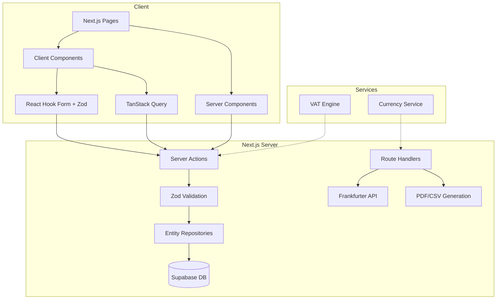
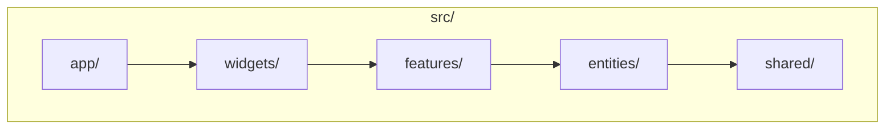

# Architecture Spine — ExpenseOS

## Design Paradigm

**Feature-Sliced Design (FSD)** with a hexagonal core — business logic isolated in `entities/` and `shared/lib/`, free of framework dependencies. Next.js App Router owns the outer adapter layer (`app/`, Server Actions, Route Handlers). This prevents business rules from leaking into presentation and keeps the domain testable without a browser.

```
┌─────────────────────────────────────┐
│  app/  (Next.js pages + routing)    │  ← outer adapter
│  widgets/  (composed UI blocks)     │  ← presentation
│  features/  (user interactions)     │  ← application services
│  entities/  (business objects + DB) │  ← domain + persistence
│  shared/  (utils, lib, UI kit)      │  ← foundation
│  processes/  (cross-cutting flows)  │  ← orchestration
└─────────────────────────────────────┘
```

Dependency flows inward: `app/ → widgets/ → features/ → entities/ → shared/`. No layer depends on layers outside it.

## Invariants & Rules

### AD-1 — Server Actions as mutation boundary

- **Binds:** all FRs involving writes (FR-1..FR-5, FR-13..FR-22, FR-26..FR-34)
- **Prevents:** client-side code writing directly to the database
- **Rule:** Every data mutation passes through a Next.js Server Action in `features/`. Server Actions validate with Zod, authorize via session, then call entity repositories. No `supabase.from().insert()` in client components.

### AD-2 — Route Handlers for API proxies only

- **Binds:** FR-23, FR-24, FR-25, FR-33, FR-34
- **Prevents:** Route Handlers replacing Server Actions for business logic
- **Rule:** Route Handlers used only for external API proxying (Frankfurter exchange rates) and file generation (CSV/PDF export). All CRUD operations use Server Actions.

### AD-3 — Supabase RLS as data isolation gate

- **Binds:** all tables (expenses, categories, profiles, settings)
- **Prevents:** horizontal data access — users seeing other users' data
- **Rule:** Every table has `user_id` column with RLS policy `user_id = auth.uid()`. Server Actions verify ownership before mutations. Future organization support adds `org_id` alongside.

### AD-4 — Zod as single validation source

- **Binds:** FR-4, FR-13, FR-14, FR-30, FR-31
- **Prevents:** validation logic duplicating between client forms and server
- **Rule:** Each entity has a Zod schema in `entities/<name>/schema.ts`. Both client forms and Server Actions import from this single source. TypeScript types derived from Zod `z.infer<>`.

### AD-5 — TanStack Query for server state

- **Binds:** FR-6..FR-12, FR-18..FR-21
- **Prevents:** over-fetching, stale data, manual caching
- **Rule:** All server data reads use TanStack Query. React Context used only for UI state (theme, sidebar, modals). No `useEffect` for data fetching. Server Actions invalidate relevant query keys on mutation.

### AD-6 — VAT engine as pure service

- **Binds:** FR-26, FR-27, FR-28
- **Prevents:** tax logic leaking into components
- **Rule:** `shared/lib/vat.ts` — pure function `calculateVAT(amount: number, rate: number): { tax: number; total: number }`. Zero side effects. Testable without database or HTTP.

### AD-7 — Exchange rate service with cache fallback

- **Binds:** FR-23, FR-24, FR-25
- **Prevents:** hard failure when Frankfurter API is unreachable
- **Rule:** `entities/currency/exchange-service.ts` fetches from Frankfurter API, caches in database, serves stale cache on failure. Cache TTL: 1 hour. Manual refresh available.

### AD-8 — Server Components by default

- **Binds:** all pages and layouts
- **Prevents:** unnecessary client bundle bloat
- **Rule:** Pages and layouts are Server Components by default. Mark `'use client'` only for components with interactivity (forms, charts, modals, toggles). Server Components fetch data directly; Client Components receive data as props.

### AD-9 — Business logic in shared/lib

- **Binds:** FR-6, FR-10, FR-11, FR-25, FR-27, FR-33, FR-34
- **Prevents:** business logic scattered across features
- **Rule:** `shared/lib/` contains: `vat.ts`, `currency.ts`, `date.ts`, `format.ts`, `export/csv.ts`, `export/pdf.ts`, `insights.ts`. No business logic in `app/`, `widgets/`, or `features/` — only orchestration.

### AD-10 — Entity repositories encapsulate DB access

- **Binds:** all data access
- **Prevents:** raw Supabase client calls spread across the codebase
- **Rule:** Each entity has a repository (`entities/<name>/repository.ts`) exposing `findAll`, `findById`, `create`, `update`, `softDelete`. Features call repositories, never `supabase.from('...')` directly.

## Consistency Conventions

| Concern | Convention |
|---|---|
| Naming (entities) | PascalCase for types/exports, camelCase for instances/files |
| Naming (files) | kebab-case for files (`expense-repository.ts`), directories match FSD slices |
| Naming (Server Actions) | verb-noun: `createExpense`, `deleteCategory`, `updateSettings` |
| Naming (Route Handlers) | `app/api/<resource>/route.ts` |
| Data (IDs) | UUID v4, `id` field on every table |
| Data (dates) | ISO 8601 UTC, stored as `timestamptz` |
| Data (amounts) | Integer cents to avoid float precision issues |
| Data (errors) | `{ error: string; code?: string }` — never raw DB errors |
| State (mutation) | Server Action → invalidate TanStack Query key → optimistic update |
| State (loading) | TanStack Query `isPending` / `isFetching` → skeleton components |
| Auth | `createServerClient()` from supabase/ssr in middleware + Server Actions |
| Config | Environment variables via `NEXT_PUBLIC_` prefix only for public values |

## Stack

| Name | Version |
|---|---|
| Next.js | 15 |
| React | 19 |
| TypeScript | 5.x |
| TailwindCSS | 4.x |
| shadcn/ui | latest |
| Supabase JS | 2.x |
| TanStack Query | 5.x |
| TanStack Table | 8.x |
| Zod | 3.x |
| React Hook Form | 7.x |
| Framer Motion | 11.x |
| Recharts | 2.x |
| date-fns | 4.x |
| Lucide React | latest |
| PostgreSQL (Supabase) | 15+ |
| Node | 20 LTS |

## Structural Seed





## Deferred

- **Real-time updates** — v1 uses TanStack Query polling/refetch. WebSockets deferred to v2.
- **File storage strategy** — Supabase Storage chosen. Upload UX (avatar, receipt images) deferred.
- **Server-side PDF generation** — v1 generates PDFs via Route Handler with a library (jsPDF/PDFKit). Deferred: dedicated PDF microservice.
- **Performance budgets** — defined at feature level. Cross-cutting budgets deferred to performance optimization phase.
- **Observability** — Vercel Analytics in production. Structured logging deferred.
- **Organization/team data model** — schema designed with `org_id` nullable. Multi-tenant enforcement deferred.
