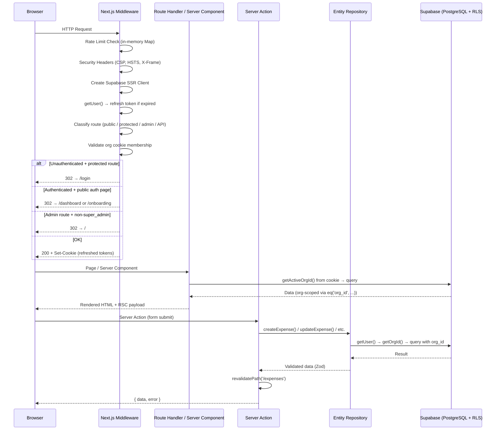
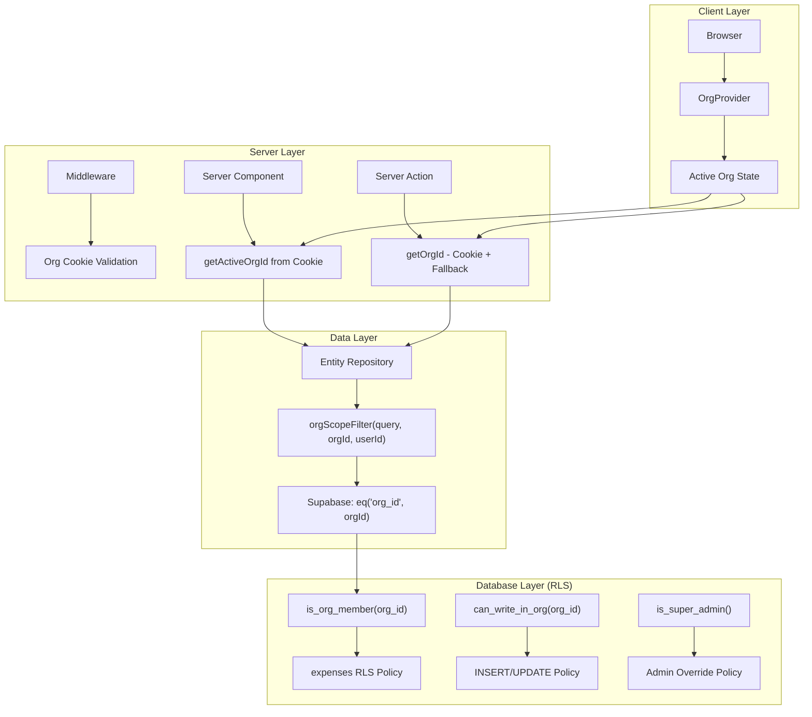
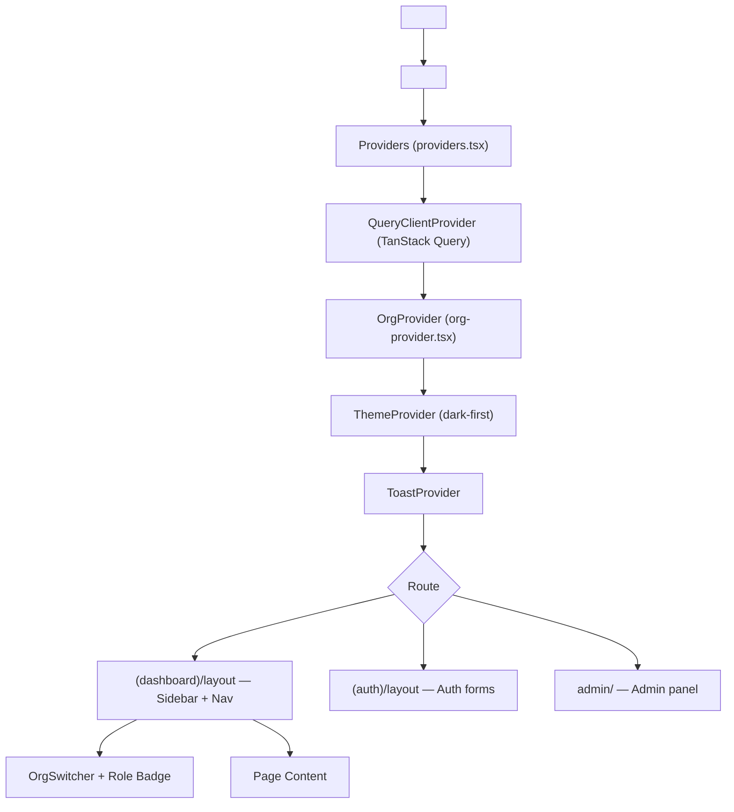
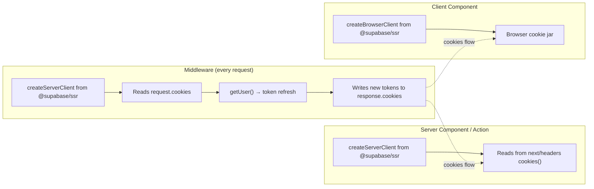
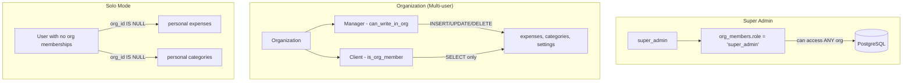
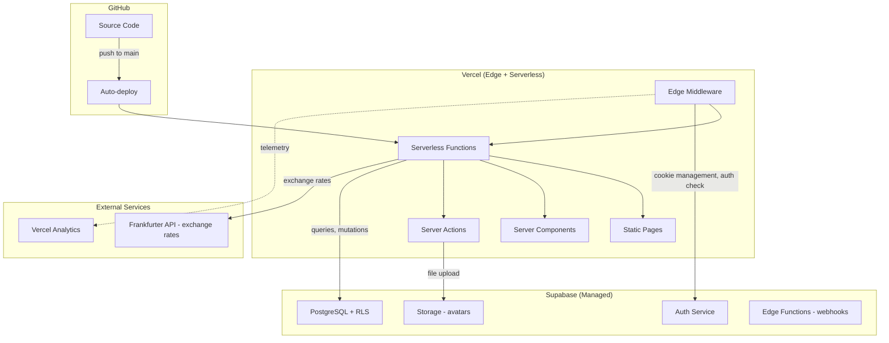

# Ledgerly — System Architecture

**Author:** Winston (System Architect)
**Version:** 1.0
**Date:** 2026-07-26
**Status:** Current

---

## 1. System Overview

Ledgerly is a premium SaaS expense tracker built on a **server-first Next.js 16** architecture with Supabase as the data layer. The codebase follows **Feature-Sliced Design (FSD)** for modularity.

### FSD Layer Hierarchy

```
src/
├── app/              # Next.js App Router — routes, layouts, pages, API handlers
│   ├── (dashboard)/  # Route group: authenticated app shell (layout, sidebar, nav)
│   ├── (auth)/       # Route group: login, signup, reset-password, verify-otp
│   ├── (onboarding)/ # Route group: new user onboarding flow
│   ├── admin/        # Super Admin panel (role-gated)
│   └── api/          # API routes (exchange rates)
├── widgets/          # Composite UI blocks (dashboard widgets, layout compositions)
├── features/         # User interactions: auth, expenses CRUD, invites, settings, PWA
├── entities/         # Domain models + data access: expense, invite, org, exchange-rate
├── shared/           # Utilities, Supabase clients, design tokens, UI primitives
│   ├── lib/          # Business utilities (org-context, rate-limit, cache, CSRF, etc.)
│   ├── ui/           # Design system components (Button, Dialog, Toast, etc.)
│   └── lib/supabase/ # Supabase client factories (server, client, middleware)
├── processes/        # (Empty — reserved for cross-feature orchestration)
└── middleware.ts     # Next.js middleware entry point
```

**Dependency rule:** Each layer may only import from layers **below** it. `app` → `widgets` → `features` → `entities` → `shared`.

### Data Flow Summary

```
Browser (React 19)
  │
  ├── Client Components (OrgProvider, dashboard layout, expense forms)
  │     ├── TanStack Query v5 (staleTime: 60s, refetchOnWindowFocus: false)
  │     └── Supabase Browser Client (@supabase/ssr → createBrowserClient)
  │
  └── Server Components / Server Actions
        ├── Supabase Server Client (@supabase/ssr → createServerClient)
        ├── Entity Repositories (expense/repository.ts, invite/repository.ts)
        └── Feature Actions (features/expenses/actions.ts, features/settings/actions.ts)
              └── revalidatePath() for cache invalidation
```

---

## 2. Technology Stack

| Layer | Technology | Version | Rationale |
|-------|-----------|---------|-----------|
| **Framework** | Next.js | 16.2.10 | App Router, Server Actions, React 19, Turbopack |
| **UI Library** | React | 19.2.4 | Server Components, `use()`, `useActionState` |
| **Language** | TypeScript | ^5 | Strict mode, `target: ES2017`, bundler resolution |
| **Styling** | Tailwind CSS | v4 | CSS-first config, zero-JS runtime |
| **Database** | Supabase (PostgreSQL) | — | Managed Postgres + RLS + auth + storage |
| **Auth** | Supabase Auth | — | Email/password + OTP, cookie-based SSR |
| **ORM/Client** | @supabase/ssr + supabase-js | 0.6.1 / 2.49.1 | SSR-aware cookie handling |
| **State** | TanStack Query | v5.64.1 | Server state cache, stale-while-revalidate |
| **Forms** | React Hook Form + Zod | 7.54.2 / 3.24.1 | Type-safe validation, minimal re-renders |
| **Icons** | Lucide React | 0.469.0 | Tree-shakeable, consistent icon set |
| **Charts** | Recharts | 2.15.0 | Declarative React chart components |
| **Animation** | Framer Motion | 11.18.0 | Page transitions, micro-interactions |
| **PDF** | jsPDF + jspdf-autotable | 2.5.2 / 3.8.4 | Client-side PDF generation |
| **UI Primitives** | Radix UI | Various | Accessible unstyled components (Dialog, Avatar, Dropdown, Slot) |
| **CVA + clsx + twMerge** | class-variance-authority | 0.7.1 | Variant-driven component APIs |
| **Testing** | Vitest + Testing Library | 4.1.10 / 16.3.2 | Fast test runner, React 19 compatible |
| **Linting** | ESLint + eslint-config-next | 9 / 16.2.10 | Next.js recommended rules |
| **Deployment** | Vercel | — | Zero-config Next.js hosting, edge middleware |
| **PWA** | Service Worker + manifest | — | Offline support, install prompt |

---

## 3. Architecture Diagrams

### 3.1 Request Lifecycle



### 3.2 Multi-Tenant Data Isolation



### 3.3 Provider Hierarchy (Component Tree)



### 3.4 Supabase Client Creation Flow



---

## 4. Security Architecture

### 4.1 Authentication

**Mechanism:** Supabase Auth with cookie-based SSR sessions.

- **Middleware** (`src/shared/lib/supabase/middleware.ts:67`): Creates `@supabase/ssr` server client, calls `getUser()` on every request to refresh tokens transparently.
- **Server Components** (`src/shared/lib/supabase/server.ts:4`): Use `cookies()` from `next/headers` to read/write auth state.
- **Client Components** (`src/shared/lib/supabase/client.ts:3`): Use `createBrowserClient` which reads from the browser cookie jar.
- **Password flow:** Email/password + OTP verification for signup.
- **Session duration:** Managed by Supabase; middleware refreshes on every request.

### 4.2 Row-Level Security (RLS)

Defined in `supabase/migrations/002_tenancy_and_security.sql`. Helper functions are `SECURITY DEFINER`:

| Function | Purpose | Used By |
|----------|---------|---------|
| `is_super_admin()` | Check if user has super_admin role in any org | RLS policies for admin override |
| `is_org_member(org_id)` | Check if user belongs to a specific org | SELECT policies on all tables |
| `can_write_in_org(org_id)` | Check if user is manager or super_admin | INSERT/UPDATE/DELETE policies |
| `get_org_role(org_id)` | Get user's role in a specific org | Role-based UI decisions |
| `user_org_ids()` | Get all org IDs the user belongs to | Bulk queries |

**Defense-in-depth model:**
1. **Middleware** — validates org cookie against `org_members` (routing layer)
2. **Application code** — `orgScopeFilter()` in repositories applies `eq('org_id', orgId)` (application layer)
3. **RLS policies** — database enforces per-org, per-role access (database layer)

### 4.3 CSRF Protection

**Status: Partially implemented (identified as dead code in audit).**

Current implementation in `src/shared/lib/csrf.ts:1-78`:
- Generates HMAC-signed tokens stored in httpOnly cookies
- Falls back to `NEXT_PUBLIC_SUPABASE_ANON_KEY` if `CSRF_SECRET` is not set
- **Not wired into middleware** — no `validateCSRFToken()` call exists in `src/middleware.ts`
- Server Actions are protected by Next.js built-in CSRF mitigation (SameSite cookies + origin checks)

**Required fix:** Either remove CSRF module entirely (relying on Next.js built-in protection) or wire `isStateChangingRequest()` + `validateCSRFToken()` into middleware.

### 4.4 Rate Limiting

**Status: Non-functional in production (in-memory Map).**

Current implementation in `src/shared/lib/rate-limit.ts:1-159`:
- Three tiers: `auth` (5/min), `api` (60/min), `general` (100/min)
- Uses `Map<string, { count, resetTime }>` — resets on server restart, not shared across instances
- `setInterval` cleanup every 5 minutes — leaks in serverless environments
- **Vercel serverless = each invocation gets a fresh Map = rate limiting is bypassed**

**Required fix:** Replace with Upstash Redis or Vercel KV for distributed rate limiting.

### 4.5 Security Headers

Defined in `next.config.ts:3-44`, applied to all routes:

| Header | Value | Purpose |
|--------|-------|---------|
| `Strict-Transport-Security` | `max-age=63072000; includeSubDomains; preload` | Force HTTPS for 2 years |
| `X-Content-Type-Options` | `nosniff` | Prevent MIME sniffing |
| `X-Frame-Options` | `SAMEORIGIN` | Prevent clickjacking |
| `X-XSS-Protection` | `1; mode=block` | Legacy XSS filter |
| `Referrer-Policy` | `strict-origin-when-cross-origin` | Limit referrer leakage |
| `Permissions-Policy` | `camera=(), microphone=(), geolocation=()` | Disable unused APIs |
| `Content-Security-Policy` | See below | Script/style/img/connect restrictions |

**CSP directives:**
- `default-src 'self'`
- `script-src 'self' 'unsafe-eval' 'unsafe-inline' https://va.vercel-scripts.com`
- `img-src 'self' blob: data: https://*.supabase.co`
- `connect-src 'self' https://*.supabase.co wss://*.supabase.co`

**Note:** CSP is also defined in `src/shared/lib/security-headers.ts` — a duplicate that should be reconciled (Audit item #18).

### 4.6 Org Cookie Security

Defined in `src/shared/lib/org-context.ts:94-102`:

```typescript
cookieStore.set(ACTIVE_ORG_COOKIE, orgId, {
  httpOnly: true,                          // XSS protection
  secure: process.env.NODE_ENV === 'production',  // HTTPS only
  sameSite: 'lax',                         // CSRF protection
  path: '/',
  maxAge: 60 * 60 * 24 * 30,              // 30 days
})
```

**Known anti-pattern (Audit item #6):** `org-provider.tsx` also sets a client-readable copy via `document.cookie` at lines 186 and 239, bypassing the httpOnly security guarantee. The server action provides the authoritative value; the client cookie is a convenience cache that should be removed.

---

## 5. Multi-Tenant Model

### 5.1 Three-User Architecture



### 5.2 Org Resolution Flow

The active org is resolved in a specific order:

1. **Middleware** (`src/shared/lib/supabase/middleware.ts:229`): Reads `ledgerly_active_org` cookie, validates against `org_members`
2. **OrgProvider** (`src/shared/lib/org-provider.tsx:122-193`): Client-side, calls `getActiveOrgIdAction()` server action to read httpOnly cookie, falls back to first org
3. **Entity repositories** (`src/entities/expense/repository.ts:14-32`): `getOrgId()` reads cookie via `getActiveOrgId()`, falls back to first `org_members` row
4. **Settings actions** (`src/features/settings/actions.ts:14-32`): Duplicate `getOrgId()` — identical logic (Audit item #17)

### 5.3 Data Isolation Pattern

Every data table (`expenses`, `categories`, `settings`, `profiles`) has an `org_id` column. The repository layer uses a scope filter:

```typescript
// src/entities/expense/repository.ts:7-12
function orgScopeFilter(query, orgId, userId) {
  if (orgId) {
    return query.eq('org_id', orgId)      // Org mode: filter by org
  }
  return query.eq('user_id', userId).is('org_id', null)  // Solo mode: personal data
}
```

### 5.4 Org Switching

Handled by `OrgProvider.switchOrg()` at `src/shared/lib/org-provider.tsx:213-243`:
1. Client-side validation of membership (defense-in-depth)
2. Sets client-readable cookie via `document.cookie`
3. Calls `window.location.reload()` to invalidate all React Query caches

**Current limitation:** Full page reload is used instead of `queryClient.clear()` + `router.refresh()` (Audit item #27).

---

## 6. Data Flow

### 6.1 Server Actions

All state-changing operations go through Next.js Server Actions (`'use server'` directive).

**Expense CRUD** (`src/features/expenses/actions.ts`):

```
createExpense(expense: ExpenseInsert)
  → createExpenseRepo(expense)      [entities/expense/repository.ts]
    → createClient()                [shared/lib/supabase/server.ts]
    → supabase.auth.getUser()       [authentication check]
    → getOrgId()                    [org resolution]
    → orgScopeFilter()              [org scoping]
    → supabase.from('expenses').insert(...)
    → expenseSchema.parse(data)     [Zod validation]
  → revalidatePath('/expenses')     [cache invalidation]
  → return { data, error }
```

**Settings** (`src/features/settings/actions.ts`):

```
updateSettings(settings: Partial<UserSettings>)
  → createClient()
  → supabase.auth.getUser()
  → getOrgId()
  → profiles.update({ display_name })  [if provided]
  → settings.upsert({ user_id, org_id, ...settingsUpdate }, { onConflict: 'user_id,org_id' })
  → revalidatePath('/settings')
```

### 6.2 Invite Acceptance (Multi-Step, Non-Transactional)

`src/entities/invite/repository.ts:92-141` performs 5 sequential Supabase calls:

1. `findInviteByToken(token)` — validate invite exists and is not expired
2. `org_members.insert({ org_id, user_id, role })` — add user to org
3. `profiles.update({ org_id })` — migrate profile
4. `categories.update({ org_id })` — migrate categories
5. `expenses.update({ org_id })` — migrate expenses
6. `expense_settings.update({ org_id })` — migrate settings
7. `invites.update({ status: 'accepted' })` — mark invite accepted

**Known issue (Audit item #4):** These are not wrapped in a transaction. If step 4 fails, the user is in the org but their data is orphaned. Should be wrapped in a Supabase RPC transaction.

### 6.3 Client-Side Data Fetching

- **TanStack Query** (`src/app/providers.tsx:8-18`): `staleTime: 60s`, `refetchOnWindowFocus: false`
- **Supabase Browser Client** (`src/shared/lib/supabase/client.ts`): `createBrowserClient` from `@supabase/ssr`
- Org-scoped queries use `activeOrg.org_id` from `OrgProvider` as query key
- Cache invalidation via `revalidatePath()` in Server Actions triggers server-side re-render

### 6.4 API Routes

Single API route: `src/app/api/rates/` — exchange rate proxy (Frankfurter API + hardcoded fallback USD/KES = 153.5).

---

## 7. Deployment Architecture



### 7.1 Environment Variables

| Variable | Scope | Purpose |
|----------|-------|---------|
| `NEXT_PUBLIC_SUPABASE_URL` | Client + Server | Supabase project URL |
| `NEXT_PUBLIC_SUPABASE_ANON_KEY` | Client + Server | Supabase anon (public) key |
| `CSRF_SECRET` | Server only | HMAC signing key (currently unused) |

### 7.2 Build & Deploy

```bash
npm run dev          # Local development (Turbopack, port 3000)
npm run build        # Production build
npm run lint         # ESLint (zero errors target)
npm test             # Vitest (59 tests)
npx vercel --prod    # Manual deploy to Vercel
git push origin main # Auto-deploy via Vercel Git integration
```

### 7.3 Database Migrations

Located in `supabase/migrations/` (6 files):

| Migration | Purpose |
|-----------|---------|
| `001_initial_schema.sql` | Base tables: profiles, categories, expenses, settings, exchange_rates + RLS |
| `002_tenancy_and_security.sql` | Multi-tenancy: organizations, org_members, subscriptions, audit_logs, RLS rewrite |
| `003_onboarding.sql` | Onboarding flow support |
| `004_messages_table.sql` | Messaging/announcements |
| `005_invites_and_solo_support.sql` | Invite system, solo user mode |
| `019_performance_optimization.sql` | Query optimization indexes |

---

## 8. Architecture Decision Records

### ADR-001: Cookie-Based Org Context (not URL-based)

**Decision:** Store active org ID in an httpOnly cookie (`ledgerly_active_org`) rather than URL segments (`/org/:id/dashboard`).

**Rationale:**
- URL-based would require rewriting all routes and breaking bookmarkability
- Cookie approach is transparent — routes stay clean
- Middleware validates the cookie on every request (defense-in-depth)
- Client-side OrgProvider reads via server action for type safety

**Tradeoffs:**
- Cookie is not visible in the URL (users can't bookmark "which org they're in")
- Org switch requires a full page reload (`window.location.reload()`)
- Dual-cookie pattern (httpOnly + client-readable) was introduced as a workaround but creates a security gap

**Status:** Accepted, with known debt to remove client-readable cookie.

### ADR-002: FSD Layer Architecture

**Decision:** Adopt Feature-Sliced Design for code organization.

**Rationale:**
- Clear dependency rules prevent circular imports
- Each layer has a single responsibility
- Entities hold business logic; features orchestrate UI; shared is truly shared
- Scales well for teams — different developers can work on different layers

**Tradeoffs:**
- Some layers are empty (`processes`, `widgets/layout`) — populated only when needed
- Strict layering can feel verbose for small features
- Barrel exports (`index.ts`) not yet implemented (Audit item #31)

**Status:** Accepted, recommended to populate or remove empty layers.

### ADR-003: Server Actions over API Routes

**Decision:** Use Next.js Server Actions for all CRUD operations; API routes only for external proxy (exchange rates).

**Rationale:**
- Server Actions integrate with Next.js caching (`revalidatePath`)
- No need to manually handle CSRF (Next.js built-in protection)
- Type safety from server action → client without code generation
- Simpler than maintaining separate API route + client fetch code

**Tradeoffs:**
- Server Actions are harder to test in isolation
- No OpenAPI/Swagger documentation (Audit item #35)
- Settings actions bypass entity layer (Audit item #16)

**Status:** Accepted, with noted debt to extract entity repositories.

### ADR-004: Soft Delete for Expenses

**Decision:** Use `is_deleted` boolean flag + `deleted_at` timestamp instead of hard deletes.

**Rationale:**
- Preserves data for audit trails and compliance
- Enables restore functionality (`restoreExpense()`)
- Prevents accidental permanent data loss
- All queries filter `eq('is_deleted', false)` consistently

**Tradeoffs:**
- Soft-deleted rows consume storage
- Queries need to always include `is_deleted` filter
- No automatic cleanup/purge mechanism

**Status:** Accepted.

### ADR-005: Supabase as Single Backend

**Decision:** Use Supabase for auth, database, storage, and (potentially) edge functions.

**Rationale:**
- Single platform reduces operational complexity
- RLS provides security at the database level (no separate auth middleware needed)
- `@supabase/ssr` handles cookie-based auth natively in Next.js
- Managed PostgreSQL scales without DevOps overhead

**Tradeoffs:**
- Vendor lock-in to Supabase
- RLS policies are complex and must be maintained in SQL migrations
- No built-in rate limiting (current in-memory implementation is non-functional)

**Status:** Accepted.

---

## 9. Technical Debt Register

Extracted from the Premium Audit Report (`PREMIUM_AUDIT.md`).

### P1: CRITICAL

| ID | Issue | Location | Status |
|----|-------|----------|--------|
| TD-001 | CSRF protection is dead code — not wired into middleware | `src/shared/lib/csrf.ts:4` | Open |
| TD-002 | Rate limiting non-functional in production (in-memory Map) | `src/shared/lib/rate-limit.ts:5` | Open |
| TD-003 | Cache non-functional in production (in-memory Map) | `src/shared/lib/cache.ts:12` | Open |
| TD-004 | Invite acceptance not transactional (5 sequential calls) | `src/entities/invite/repository.ts:92-141` | Open |
| TD-005 | Invite operations missing auth/role checks | `src/entities/invite/repository.ts:44,57` | Open |
| TD-006 | Dual-cookie bypasses httpOnly security | `src/shared/lib/org-provider.tsx:186,239` | Open |
| TD-007 | Reports page 100% hardcoded mock data | `reports/page.tsx` | Open |
| TD-008 | Categories page 100% hardcoded mock data | `categories/page.tsx` | Open |
| TD-009 | Fake "Trusted By" logos on landing page | `page.tsx:295-303` | Open |
| TD-010 | Landing page promises features that don't exist | `page.tsx` (multiple) | Open |

### P2: HIGH

| ID | Issue | Location | Status |
|----|-------|----------|--------|
| TD-011 | No CSV/PDF export with real data | Features layer | Open |
| TD-012 | No budgeting/budget limits per category | Features layer | Open |
| TD-013 | No recurring expenses | `src/features/recurring/` (migration 015) | Done |
| TD-014 | No expense attachments/receipt upload | `src/features/attachments/` + `receipts` bucket (migration 016) | Done |
| TD-015 | Dashboard layout is entirely client-rendered | `src/app/(dashboard)/layout.tsx` | Open |
| TD-016 | Settings actions bypass entity layer (FSD violation) | `src/features/settings/actions.ts` | Open |
| TD-017 | Duplicate `getOrgId()` helper | `expense/repository.ts:14` + `settings/actions.ts:14` | Open |
| TD-018 | CSP defined in two conflicting locations | `next.config.ts` + `security-headers.ts` | Open |
| TD-019 | Expense stats show page-only total, not full total | Expense page | Open |
| TD-020 | Settings page generates fake email from display name | Settings page | Open |

### P3: MEDIUM

| ID | Issue | Location | Status |
|----|-------|----------|--------|
| TD-021 | Password toggle missing `aria-label` | `login/page.tsx:93`, `login-form.tsx:74` | Open |
| TD-022 | No skip-to-content link | `dashboard/layout.tsx` | Open |
| TD-023 | Native `<select>` elements look jarring | `settings/page.tsx:289`, `admin/page.tsx` | Open |
| TD-024 | Admin announcements don't actually send | `admin/page.tsx:563-571` | Open |
| TD-025 | No error boundaries on dashboard routes | `(dashboard)/routes` | Open |
| TD-026 | `maximumScale: 1` prevents pinch-to-zoom | `src/app/layout.tsx:29` | Open |
| TD-027 | `window.location.reload()` on org switch | `org-provider.tsx:243` | Open |
| TD-028 | No Tooltip component | Global | Open |
| TD-029 | Duplicate sidebar JSX (~70 lines) | `layout.tsx:152-286` | Open |
| TD-030 | Login "Remember me" checkbox unstyled | `login/page.tsx:104-108` | Open |

### P4: LOW

| ID | Issue | Location | Status |
|----|-------|----------|--------|
| TD-031 | No barrel exports (`index.ts`) in entity/feature dirs | Entity/feature directories | Open |
| TD-032 | Empty FSD layers (widgets/layout, processes) | `src/widgets/`, `src/processes/` | Open |
| TD-033 | Duplicate `'use client'` in org-provider | `org-provider.tsx:30` | Open |
| TD-034 | Dynamic import in `duplicateExpense` | `features/expenses/actions.ts:53` | Open |
| TD-035 | No API documentation | Global | Open |
| TD-036 | No architecture decision records | Global | Open (this document addresses) |
| TD-037 | No developer onboarding guide | Global | Open |
| TD-038 | Pricing inconsistency (landing vs onboarding) | `page.tsx` + onboarding | Open |
| TD-039 | Landing mobile bottom nav links to Settings→/login | Landing page | Open |
| TD-040 | No page transitions | `src/shared/ui/page-transition.tsx` (pathname-keyed `animate-fade-in`, `prefers-reduced-motion` respected) | Done |

---

## 10. Scalability Considerations

### 10.1 Current Bottlenecks

| Bottleneck | Impact | Mitigation Path |
|-----------|--------|-----------------|
| In-memory rate limiting | No rate limiting in production (serverless) | Upstash Redis or Vercel KV |
| In-memory cache | No shared cache across instances | Upstash Redis |
| `window.location.reload()` on org switch | Full page flash, poor UX | `queryClient.clear()` + `router.refresh()` |
| Dashboard layout is 100% client-rendered | Slow initial paint, no SSR benefits | Extract sidebar to client component, make layout Server Component |
| Invite acceptance is non-transactional | Data inconsistency on partial failure | Supabase RPC transaction |
| Single API route (exchange rates) | No API versioning | Consider `/api/v1/` prefix when adding more |

### 10.2 Database Scaling

- **Current:** Single PostgreSQL instance via Supabase
- **Indexes:** 25+ indexes across all tables (defined in migrations 001-002)
- **RLS overhead:** Every query evaluates RLS policies — adds ~1-2ms per query
- **Recommended:** Monitor slow query logs; consider materialized views for aggregate reports
- **Partitioning:** When `expenses` table exceeds 10M rows, partition by `org_id` or date range

### 10.3 Vercel Serverless Constraints

- **Function execution time:** 10s (Hobby) / 60s (Pro) — long-running queries will timeout
- **Cold starts:** Supabase SSR client creation on each invocation adds ~50-100ms
- **Middleware:** Runs at the edge — must be fast; current rate-limit + auth check is acceptable
- **Static pages:** Dashboard pages use `force-dynamic` (no static generation)

### 10.4 PWA / Offline

- Service worker registered via `src/features/pwa/service-worker-registration.ts`
- Install prompt handled by `src/features/pwa/install-prompt.ts`
- **Gap:** No offline data sync — Supabase queries require network

### 10.5 Horizontal Scaling Path

```
Current:  Vercel Serverless + Supabase (single instance)
          ↓
Phase 2:  Add Redis (Upstash) for rate limiting + caching
          ↓
Phase 3:  Add edge middleware for geo-based routing
          ↓
Phase 4:  Supabase read replicas for analytics queries
          ↓
Phase 5:  Consider Turso/PlanetScale for edge database if latency is critical
```

---

## Appendix A: Key File Reference

| Purpose | File Path |
|---------|-----------|
| Root layout (fonts, providers, PWA) | `src/app/layout.tsx` |
| Dashboard shell (sidebar, nav, mobile) | `src/app/(dashboard)/layout.tsx` |
| Provider tree (QueryClient, OrgProvider) | `src/app/providers.tsx` |
| Middleware entry point | `src/middleware.ts` |
| Auth middleware (session refresh, route guard) | `src/shared/lib/supabase/middleware.ts` |
| Supabase server client | `src/shared/lib/supabase/server.ts` |
| Supabase browser client | `src/shared/lib/supabase/client.ts` |
| Server-side org context | `src/shared/lib/org-context.ts` |
| Client-side org provider | `src/shared/lib/org-provider.tsx` |
| Expense repository (CRUD + org scoping) | `src/entities/expense/repository.ts` |
| Invite repository (accept + migration) | `src/entities/invite/repository.ts` |
| Expense feature actions | `src/features/expenses/actions.ts` |
| Settings feature actions | `src/features/settings/actions.ts` |
| CSRF protection | `src/shared/lib/csrf.ts` |
| Rate limiting | `src/shared/lib/rate-limit.ts` |
| In-memory cache | `src/shared/lib/cache.ts` |
| Security headers + CSP | `next.config.ts` |
| Initial DB schema | `supabase/migrations/001_initial_schema.sql` |
| Multi-tenancy + RLS rewrite | `supabase/migrations/002_tenancy_and_security.sql` |
| Invite + solo support | `supabase/migrations/005_invites_and_solo_support.sql` |
| Premium audit report | `PREMIUM_AUDIT.md` |

---

*This document is the canonical architecture reference for Ledgerly. Update it when significant architectural decisions are made or the system topology changes.*
